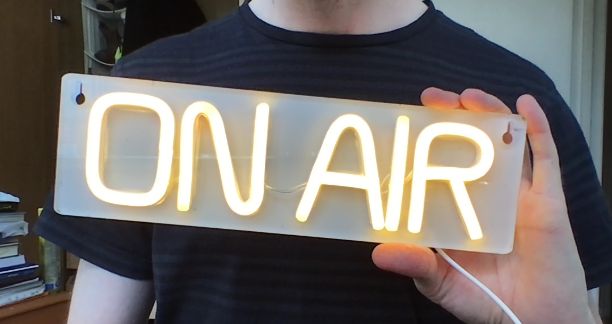

# ON AIR light

**Because it's about time people stopped barging into your room when you're on Zoom**

Powered by [ESPHome](https://esphome.io/) and [MQTT](https://mqtt.org/).



## Setup

Prerequistes: A MacOS computer with up to date OS.

First, set up the monitoring agent, which will send MQTT messages when your computer turns the camera on and off.

1. If you don't already have it, [install Homebrew](https://brew.sh/).

1. If you don't already have Mosquitto, use Homebrew to install it:
    ```sh
    brew install mosquitto
    ```

1. Check out this repo
    ```sh
    git clone git@github.com:triblondon/on-air-lights.git
    cd on-air-lights
    ```

1. Make a copy of `config-dist.sh` called `config.sh`:
    ```sh
    cp config-dist.sh config.sh
    ```

1. Open the new `config.sh` file in your favourite text editor and fill in the required values, eg:
    ```sh
    mqtt_server=foo.cloudmqtt.com
    mqtt_port=12345
    mqtt_user=jane
    mqtt_password=password
    mqtt_topic=on-air-sign
    ```

1. Run the script
    ```sh
    monitor/on-air-monitor.sh
    ```

Now, set up the hardware:

1. Make or acquire an ON-AIR light.  This could be a neon-y sign like mine or just any old light that turns on when you send power to it.

1. Install the [ESPHome CLI](https://esphome.io/guides/getting_started_command_line.html)

1. Plug an ESP8266 or ESP32 microcontroller into a spare USB port on your computer.  I used the tiny ESP-01S paired with the purpose-made relay module which can often be purchased together (eg. [Amazon](https://www.amazon.co.uk/ESP8266-Appliance-Illuminator-Wireless-Transceiver/dp/B097BNMRY8)).

1. Make a copy of `secrets-dist.yaml` called `secrets.yaml`:
    ```sh
    cd esphome
    cp secrets-dist.yamls secrets.yaml
    ```

1. Open the new `secrets.yaml` file in your favourite text editor and fill in the required values, eg:
    ```yaml
    wifi_ssid: "Foo"
    wifi_password: "password"
    mqtt_server: "foo.cloudmqtt.com"
    mqtt_port: 12345
    mqtt_username: "jane"
    mqtt_password: "password"
    ```

1. Install the ESPHome configuration onto the microcontroller:
    ```
    esphome run esphome/on-air-light.yaml
    ```

1. Unplug the microcontroller from the computer and connect it to a relay that is controlling your ON AIR light.  Connect the relay to GPIO0 (which is the correct pin for the ESP-01S Relay module)

Great! Now when your computer turns the camera on, your sign will light up.